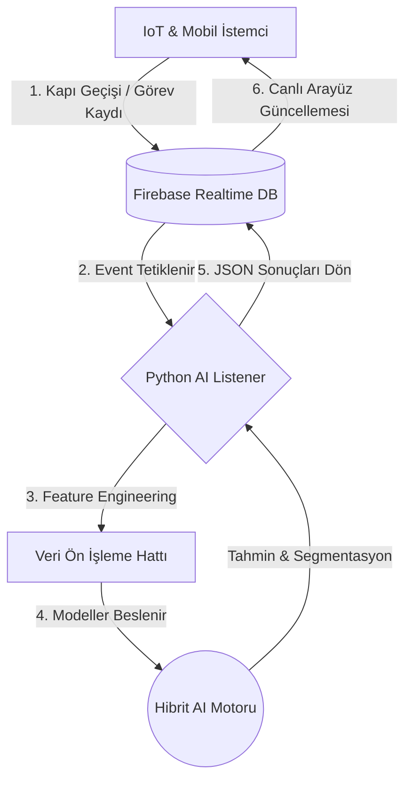

# 🧠 Yapay Zeka Destekli Akıllı Ofis ve Personel Verimlilik Sistemi
### Backend & AI Engine


Geleneksel "mesai saatine dayalı" ofis yönetimini tarih eden; çalışan performansını analiz eden, görev tamamlama sürelerini otonom olarak tahmin eden ve davranışsal kümeleme (clustering) algoritmalarıyla ofis yerleşimini optimize eden **Uçtan Uca (End-to-End) Yapay Zeka Arka Uç (Backend)** mimarisi.

Bu sistem, donanımdan (IoT/Turnike) gelen ham verileri işleyerek **Hibrit Makine Öğrenmesi**, **Doğal Dil İşleme (NLP)** ve **Gerçek Zamanlı Veri Akışı** ile şirketin verimliliğini maksimize eden "yaşayan" bir analitik motor olarak tasarlanmıştır.

> **💡 Proje Mimari İş Bölümü:** Bu sistem tam bir endüstri standartlarında mikroservis/modüler yapıda kurgulanmıştır. IoT etkileşimi ve kullanıcı arayüzü (Flutter Client) takım arkadaşım tarafından geliştirilirken; büyük verinin işlenmesi, öğrenme algoritmalarının eğitilmesi ve karar mekanizmalarının işletilmesi **(Yapay Zeka ve Backend)** tarafımca tasarlanıp geliştirilmiştir.

---

## 📋 İçindekiler

- [Problem ve Çözüm Yaklaşımı](#-problem-ve-çözüm-yaklaşımı)
- [Event-Driven Veri Akışı](#️-event-driven-olay-güdümlü-veri-akışı)
- [Yapay Zeka Modülleri](#-gelişmiş-yapay-zeka-modülleri)
- [Hedeflenen KPI'lar](#-hedeflenen-performans-metrikleri-kpis)
- [Proje Dizin Yapısı](#-proje-dizin-yapısı)
- [Kullanılan Teknolojiler](#️-kullanılan-teknolojiler-ve-kütüphaneler)
- [Kurulum ve Çalıştırma](#-kurulum-ve-çalıştırma)
- [Geliştirici](#️-geliştirici)

---

## 🏗️ Problem ve Çözüm Yaklaşımı

**Geleneksel Ofis Problemi:** Yöneticiler işleri sezgisel olarak atar, çalışma süreleri manuel takip edilir ve ofis oturma planları rastgele veya unvana göre belirlenir. Bu durum derin odaklanma gerektiren yazılımcıların gürültülü ortamlarda verim kaybetmesine, çalışan başarılarının göz ardı edilmesine yol açar.

**AI Destekli Çözüm:** Sensörlerden gelen veriler makine öğrenmesi algoritmalarıyla işlenerek:

> **"Kim, hangi işi, ofisin neresinde en yüksek verimle yapar?"**

sorusunun matematiksel cevabı bulunur.

---

## ⚙️ Event-Driven (Olay Güdümlü) Veri Akışı

Sistem, hantal REST API (Request-Response) yapıları yerine milisaniyelik gecikmelerle çalışan **Event-Driven** bir altyapı kullanır. Python tabanlı dinleyiciler (Daemons), veritabanındaki değişiklikleri anlık yakalar.



---

## 🧠 Gelişmiş Yapay Zeka Modülleri

Sistem, şirketin operasyonel zekasını yöneten iki dev analitik motor barındırır:

### 1. NLP Destekli Görev Süresi Tahmin Motoru
*Predictive Task Analytics*

Yöneticilerin atadığı görevlerin fiili olarak ne kadar süreceğini ve çalışanın hız profilini analiz eden **Denetimli Öğrenme (Supervised Learning)** tabanlı regresyon modülüdür.

- **NLP ile Dinamik Zorluk Tespiti (Text Mining):** Görev açıklaması sisteme girildiğinde metin madenciliği algoritmaları devreye girer. Metin token'lara ayrılır ve ağırlıklı teknik terimler (`API entegrasyonu`, `veritabanı optimizasyonu`, `debug` vb.) tespit edilerek görevin "Baz Zorluk Katsayısı" algoritmik olarak artırılır.

- **Gradient Boosting Regressor (GBM) Mimarisi:** İnsan davranışındaki sapmaları modellemek zordur. Basit doğrusal regresyon modelleri yerine, hata paylarını minimize eden ve aykırı değerlere (outliers) karşı dirençli **ağaç tabanlı (Tree-based) topluluk modelleri** kullanılmıştır. Model, Ortalama Kare Hata (MSE) kayıp fonksiyonu ile optimize edilmiştir.

- **Kişisel Hız Çarpanı ve Oyunlaştırma (Gamification):** Model yalnızca göreve bakmaz; görevi yapacak kişinin geçmiş performansını, mola frekansını ve hata oranlarını analiz ederek **kişiye özel bir hız çarpanı** üretir. Beklenen süreden daha hızlı çalışan personeller otomatik algılanır, XP (Experience Point) ile ödüllendirilir ve "Haftanın Çalışanı" sıralamasına dahil edilir.

---

### 2. K-Means ile Davranışsal Kümeleme
*Unsupervised Learning*

Çalışanların ofis içi davranışları (IoT, turnike, login/logout verileri) kullanılarak ofis yerleşim planını optimize eden yapısal modüldür.

- **Öznitelik Çıkarımı (Feature Engineering & Preprocessing):** Ham zaman damgaları (timestamps) milisaniye dönüşümleriyle anlamlı verilere dönüştürülür. Gürültülü veya eksik (NaN) sensör verileri filtrelenir. Çalışan bazında; Net Masa Başı Süresi, Kesintisiz Odaklanma Periyodu (Deep Work Timer) ve Mola Frekansı hesaplanarak "Mobilite" ve "Odaklanma" matrisleri oluşturulur.

- **Elbow Yöntemi ve Segmentasyon:** Etiketlenmemiş (unlabeled) veriler K-Means Clustering algoritmasına beslenir. Algoritmanın optimal küme sayısını (K) belirlemek için WCSS (Within-Cluster Sum of Square) hesaplaması yapılarak Dirsek (Elbow) yöntemi uygulanır.

$$WCSS = \sum_{i=1}^{k} \sum_{x \in C_i} (x - \mu_i)^2$$

- **Profil Sınıflandırması:** Analiz sonucunda çalışanlar uzaysal olarak 3 ana merkeze (Centroid) yerleşir:

| Profil | Segment | Açıklama | Ofis Konumu |
|--------|---------|----------|-------------|
| 🔴 | **Yüksek Mobilite** | Saha/Operasyon — Sürekli giriş-çıkış yapan, hareketliliği yüksek profiller | Ofis kapısına yakın |
| 🟢 | **Yüksek Etkileşim / Hub** | Product/İK — Şirketin iletişim ağını yöneten, çok sayıda çakışma yaşayan sosyal profiller | Ofisin merkezi |
| 🔵 | **Derin Odak / Deep Focus** | Yazılım/AI — Kesintisiz çalışma gerektiren, yüksek odaklanma skoruna sahip profiller | En izole ve sessiz köşe |

---

## 📈 Hedeflenen Performans Metrikleri (KPIs)

| Metrik | Hedef Değer | Açıklama |
|--------|-------------|----------|
| ⚡ **Ultra Düşük Gecikme** | < 200 ms | Donanımdan buluta, AI modelinden arayüze toplam tur süresi |
| 🛡️ **Hata Toleransı** | Sıfır çökme | Bozuk veriler "Data Cleansing" katmanında sistem çökmeden temizlenir |
| 📊 **Operasyonel Verimlilik** | %30 artış | Odak kaybı engellenerek ve görev süreleri veriye dayalı hesaplanarak |
| 🔔 **Burnout Önleme** | Otomatik uyarı | Eşik değerin üzerinde çalışan personeller için yöneticiye "Risk" bildirimi |

---

## 📂 Proje Dizin Yapısı

```
ai-smart-office-backend/
├── data/                  # Sentetik ve gerçek zamanlı log verileri
├── models/                # Eğitilmiş GBM ve K-Means model dosyaları (.pkl)
├── src/
│   ├── preprocessing.py   # Veri temizleme ve özellik çıkarımı
│   ├── nlp_engine.py      # Görev açıklamaları için metin analizi
│   ├── clustering.py      # K-Means algoritmaları ve Elbow grafikleri
│   └── prediction.py      # Gradient Boosting görev süresi tahmini
├── main_listener.py       # Firebase'i anlık dinleyen ana daemon
├── requirements.txt       # Proje bağımlılıkları
└── README.md              # Proje dokümantasyonu
```

---

## 🛠️ Kullanılan Teknolojiler ve Kütüphaneler

| Katman | Teknoloji |
|--------|-----------|
| **Çekirdek** | Python 3.9+ |
| **Makine Öğrenmesi** | Scikit-Learn, XGBoost / LightGBM |
| **Doğal Dil İşleme** | NLTK (Tokenization, Keyword Extraction) |
| **Veri Analizi & Görselleştirme** | Pandas, NumPy, Matplotlib, Seaborn |
| **Bulut & İletişim** | Firebase Realtime Database, Firebase Admin SDK |

---

## 💻 Kurulum ve Çalıştırma

> Sistem, yazma/okuma izinleri ayarlanmış canlı bir Firebase Realtime DB projesi gerektirir.

**1. Repoyu Klonlayın:**
```bash
git clone https://github.com/KULLANICI_ADIN/ai-smart-office-backend.git
cd ai-smart-office-backend
```

**2. Sanal Ortam Oluşturun ve Aktif Edin:**
```bash
python -m venv venv
source venv/bin/activate   # Windows için: venv\Scripts\activate
```

**3. Gerekli Kütüphaneleri Yükleyin:**
```bash
pip install -r requirements.txt
```

**4. Veritabanı Bağlantısını Yapılandırın:**

Firebase konsolundan oluşturduğunuz `serviceAccountKey.json` gizli anahtar dosyanızı projenin ana dizinine yerleştirin.

**5. AI Dinleyicisini (Listener) Başlatın:**
```bash
python main_listener.py
```

Terminalde `[Firebase] Canlı veri akışı dinleniyor...` mesajını gördüğünüzde yapay zeka motorunuz donanım ve mobil uygulama ile entegre çalışmaya başlamıştır.

---

## 👨‍💻 Geliştirici

**Meriç Şimşek**
Bilgisayar Mühendisliği | Yapay Zeka, MLOps ve Veri Bilimi
